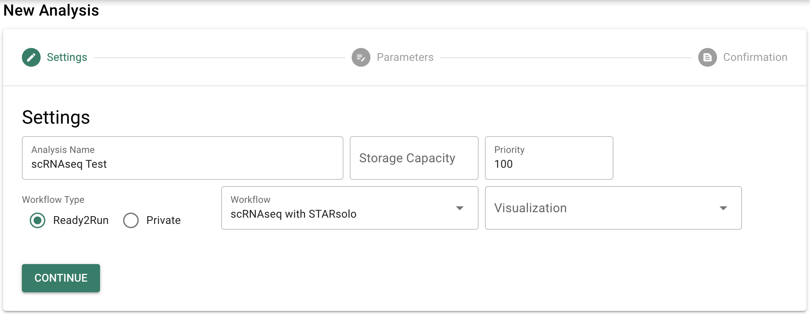
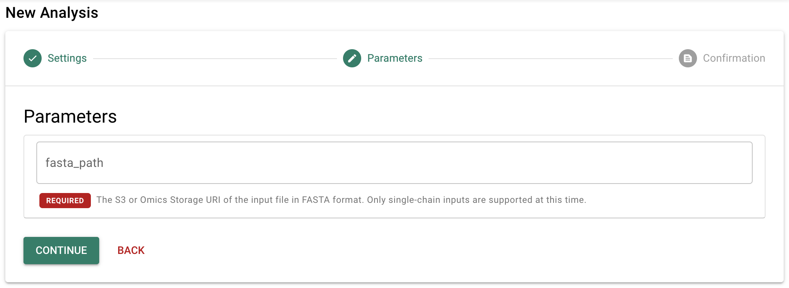
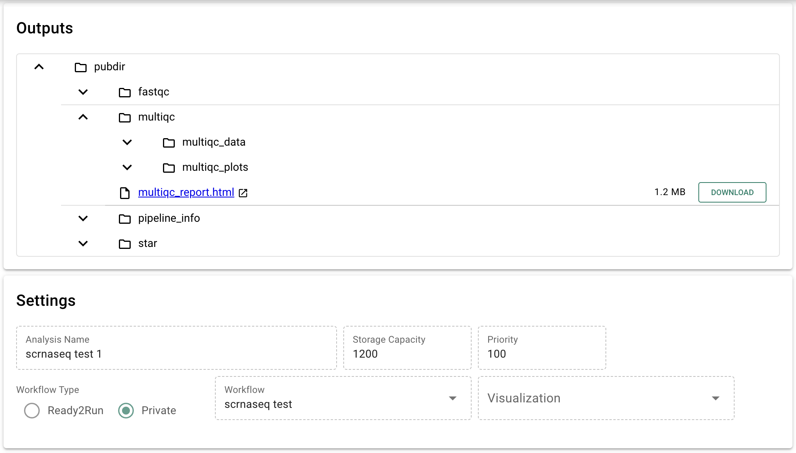
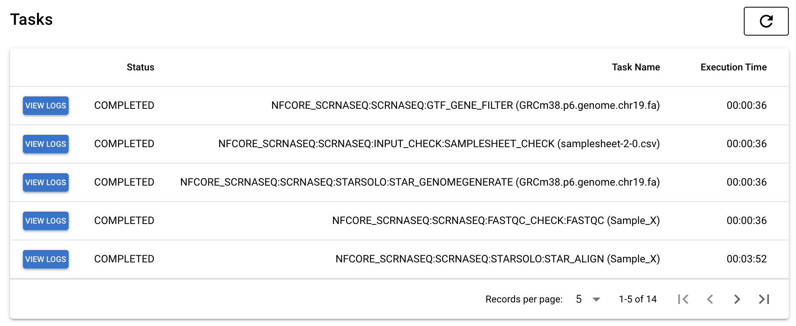
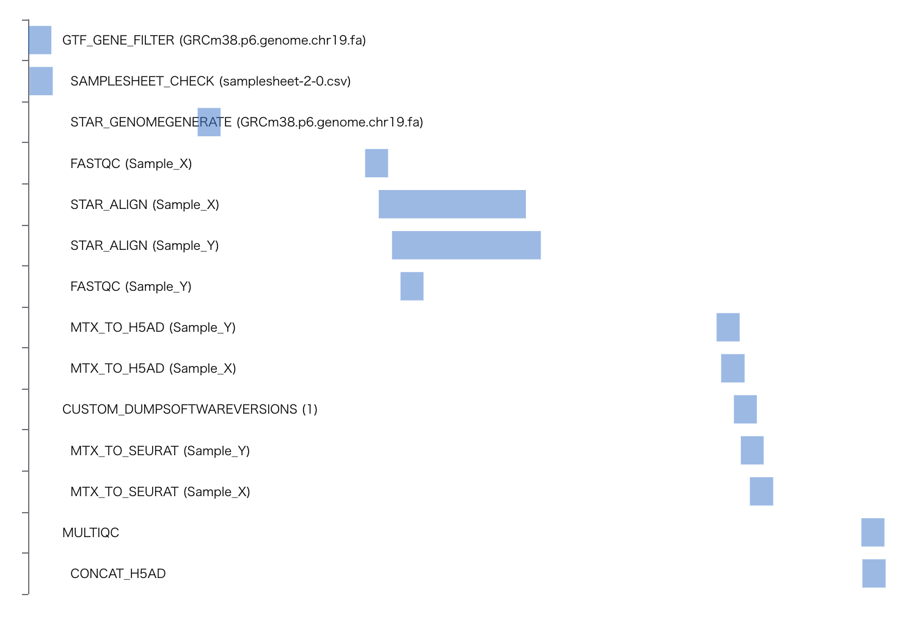
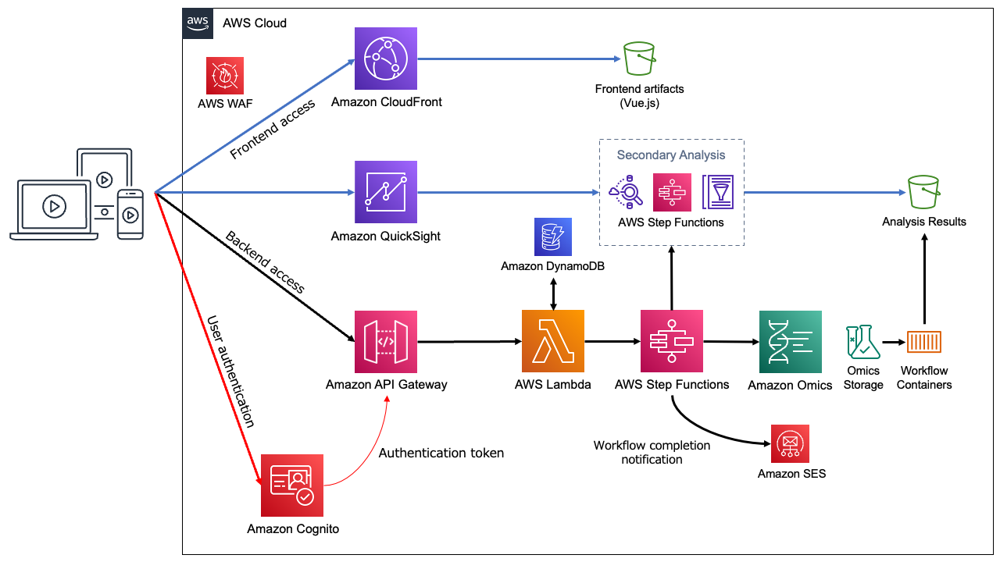
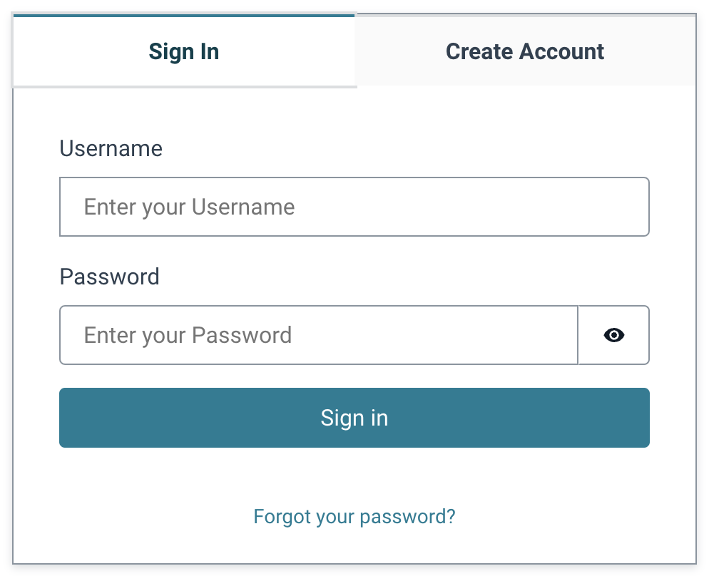
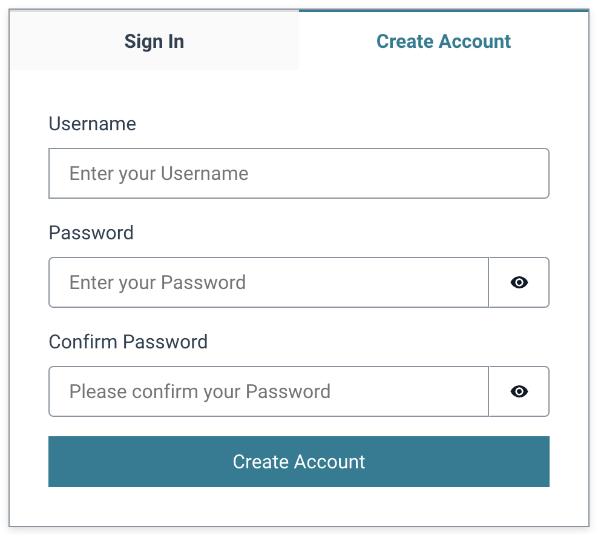
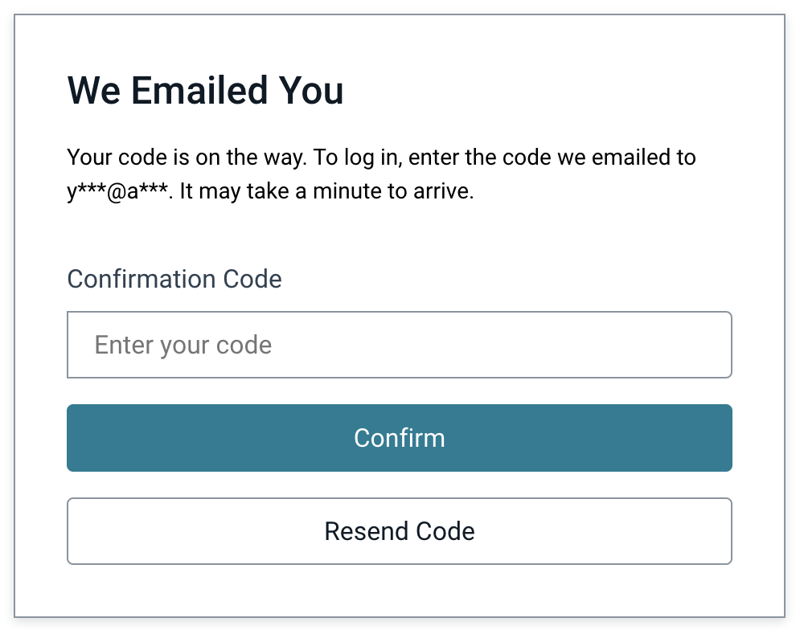

# AWS HealthOmics Analysis App

このリポジトリには以下のコードが含まれています。

- Vue.js と Quasar で実装されたフロントエンドアプリケーション
  - [AWS HealthOmics](https://aws.amazon.com/healthomics/) によるバイオインフォマティックスのワークフローの実行
  - [AWS Step Functions](https://aws.amazon.com/step-functions/) による二次解析 (可視化) の実行
  - [Amazon Simple Email Service (SES)](https://aws.amazon.com/ses/) によるワークフロー完了通知メールの送信
  - ワークフロー実行結果のブラウズ
  - ワークフローで実行されたタスクの詳細情報の表示

- [Amazon API Gateway](https://aws.amazon.com/api-gateway/) と [AWS Lambda](https://aws.amazon.com/lambda/) 関数 (Python) で実装されたバックエンド API.
  - [Amazon Cognito](https://aws.amazon.com/cognito/) によるユーザー認証
  - フロントエンドが必要とする機能を API Gateway の REST API で提供

- フロントエンドとバックエンドをデプロイするための [AWS CDK](https://aws.amazon.com/cdk/) スタック

## スクリーンショット

<p align="center">
  
  
  
  
  
</p>

## アーキテクチャ



## デプロイ方法

### 前提条件

- [AWS Command Line Interface (AWS CLI)](https://aws.amazon.com/cli/)
- Node.js
- Docker

### cdk.json の編集

必要に応じて、[cdk.json](../cdk/cdk.json) に以下の項目を追加して下さい。

- `allowdIPv4AddressRanges`: アプリケーションへのアクセスを許可する IPv4 アドレス
- `allowdIPv6AddressRanges`: アプリケーションへのアクセスを許可する IPv6 アドレス
- (これらの項目が無ければ、IP アドレス制限無しでデプロイされます)

設定例
```
"context": {
  "allowdIPv4AddressRanges": ["100.100.100.0/24"],
  "allowdIPv6AddressRanges": ["1000:1000:1000:1000::/64"],
  ...
}
```

### デプロイ

`/cdk` ディレクトリで以下のコマンドを実行して下さい。

```
npm ci
npx cdk bootstrap
npx cdk deploy OmicsBackendStack --require-approval never
npx cdk deploy OmicsFrontendStack --require-approval never
```

### メールアドレスの検証

ワークフローの完了通知メールを受信するには、[こちらのガイド](https://docs.aws.amazon.com/ses/latest/dg/creating-identities.html#verify-email-addresses-procedure)に従ってメールアドレスを検証し、Amazon SES のセキュリティ制限を解除する必要があります。

### サインイン

デプロイが完了したら、`OmicsFrontendStackxxxx.FrontendURL` として以下のように表示された URL にアクセスする事でアプリケーションを利用できます。

```
OmicsFrontendStackxxxx.FrontendURL = https://xxxx.cloudfront.net
```



アカウントを作成するには、「Create Account」タブを選択してメールアドレスとパスワードを入力し、「Create Account」ボタンをクリックします。



入力したメールアドレスに「Verify your new account」という題名のメールが届いたら、そのメールに書かれた6桁の数字を「Confirmation Code」の欄に入力して「Confirm」ボタンをクリックします。



すると、アカウントが作成されてアプリケーションが表示されます。

## ドキュメント

- [REST API 仕様](docs/api.ja.md)
- [Step Functions ステートマシンの定義](docs/stepfunctions.ja.md)
