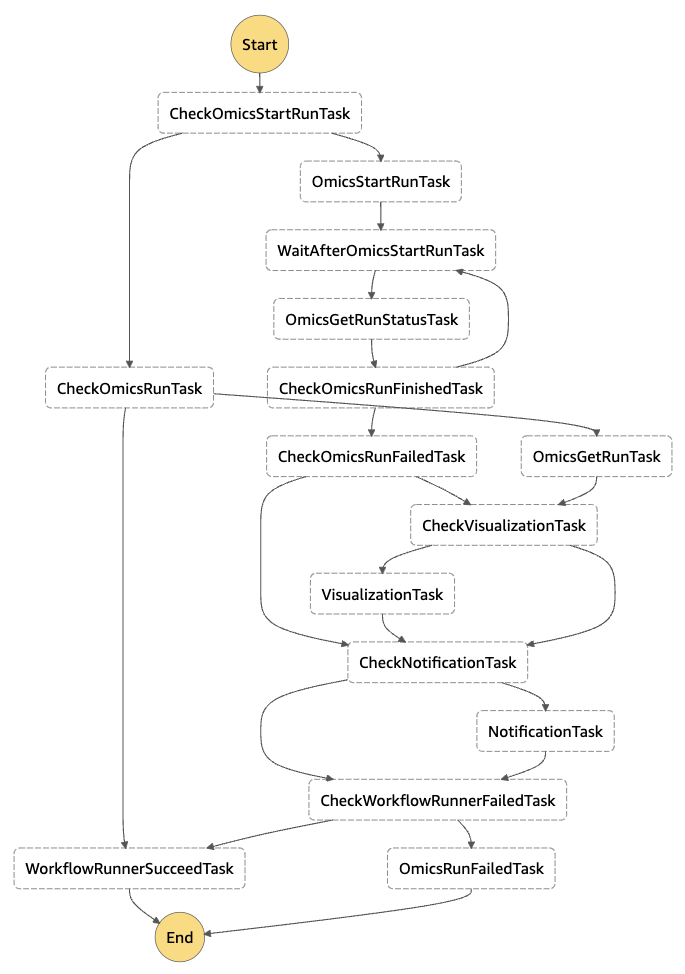

# Amazon Omics Analysis App

This repository contains the following codes.

- Frontend application implemented by Vue.js and Quasar.
  - Run Amazon Omics workflows and secondary analysis (visualization) through AWS Step Functions.
  - Browse workflow run outputs.
  - View details of the tasks executed in the workflow run.

- Backend API implemented by Amazon API Gateway and AWS Lambda function (Python).
  - User authentication with Amazon Cognito.
  - Provides all functionality required by frontend through REST API.

- AWS CDK stack to deploy frontend and backend.

## Architecture


## Getting started

### Prerequisites

- Docker
- Node.js
- [aws cli](https://aws.amazon.com/jp/cli/)

### Edit cdk.json

Edit [cdk.json](../cdk/cdk.json) as needed.

- `allowdIPv4AddressRanges`: IPv4 address range you want to allow access.
- `allowdIPv6AddressRanges`: IPv6 address range you want to allow access.
- (Removing both items above will deploy without IP address restrictions)

Example
```
"context": {
  "allowdIPv4AddressRanges": ["100.100.100.0/24"],
  "allowdIPv6AddressRanges": ["1000:1000:1000:1000::/64"],
  ...
}
```

### Deployment

Execute the following commands in `/cdk` directory.

```
npm ci
cdk bootstrap
cdk deploy OmicsBackendStack --require-approval never
cdk deploy OmicsFrontendStack --require-approval never
```

### Verify your email address

To receive email of workflow completion notification, your email address must be verified by following [instructions](https://docs.aws.amazon.com/ses/latest/dg/creating-identities.html#verify-email-addresses-procedure) due to Amazon Simple Email Service (SES) security restrictions.

### Sign in

Now you can use this application by accessing the following URL displayed as `OmicsFrontendStackxxxx.FrontendURL` when 'cdk deploy'.

```
OmicsFrontendStackxxxx.FrontendURL = https://xxxx.cloudfront.net
```

## Step Functions state machine definition

In this application, Step Functions state machine named 'OmicsWorkflowRunner' performs the following tasks.

### Run Amazon Omics workflow

| Task name                  | Task type | Description |
| -------------------------- | --------- | ----------- |
| CheckOmicsStartRunTask     | Choice    | Is 'OmicsStartRun' present in the input? |
| OmicsStartRunTask          | Lambda    | Start Omics workflow run. |
| WaitAfterOmicsStartRunTask | Wait      | Wait for a few minutes for Omics workflow run to complete. |
| OmicsGetRunStatusTask      | Lambda    | Get Omics run status as 'OmicsRun' output. |
| CheckOmicsRunFinishedTask  | Choice    | Is Omics workflow run finished? |
| CheckOmicsRunFailedTask    | Choice    | Is Omics workflow run failed? |

### Visualize workflow run outputs

| Task name              | Task type      | Description |
| ---------------------- | -------------- | ----------- |
| CheckVisualizationTask | Choice         | Is 'Visualization' present in the input? |
| VisualizationTask      | Step Functions | Start visualization of workflow run outputs with nested Step Functions state machine. |

### Notify completion of analysis

| Task name             | Task type | Description |
| --------------------- | --------- | ----------- |
| CheckNotificationTask | Choice    | Is 'Notification' present in the input? |
| NotificationTask      | Lambda    | Notify completion of analysis. |


