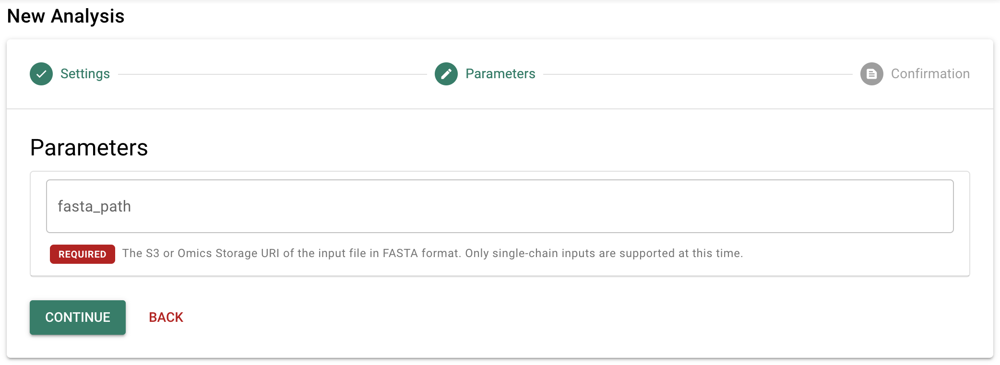
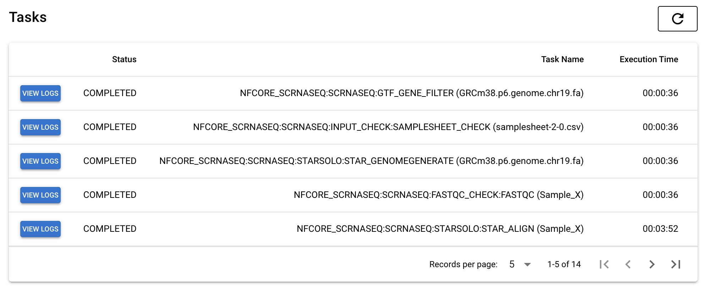
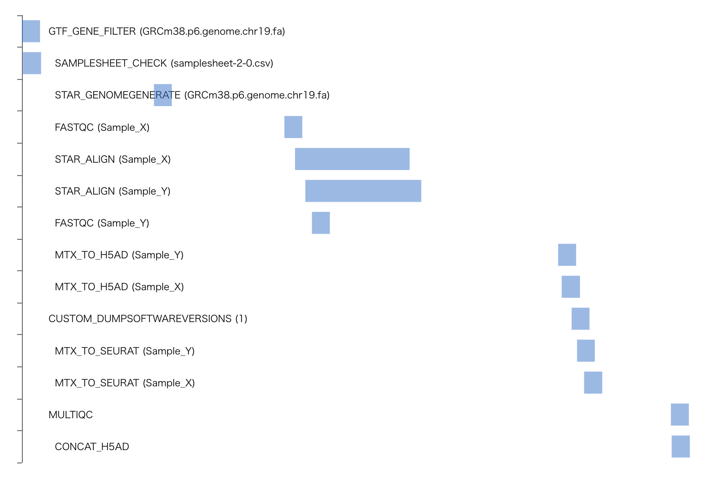
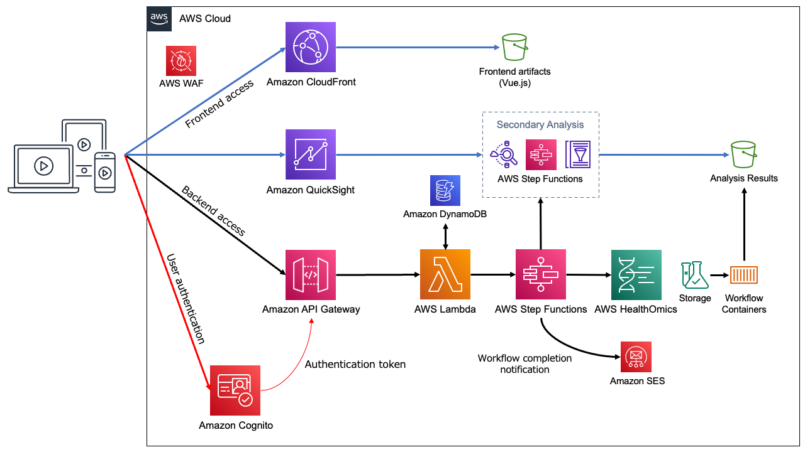
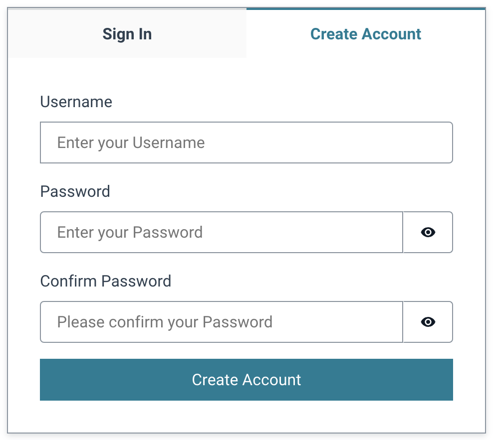
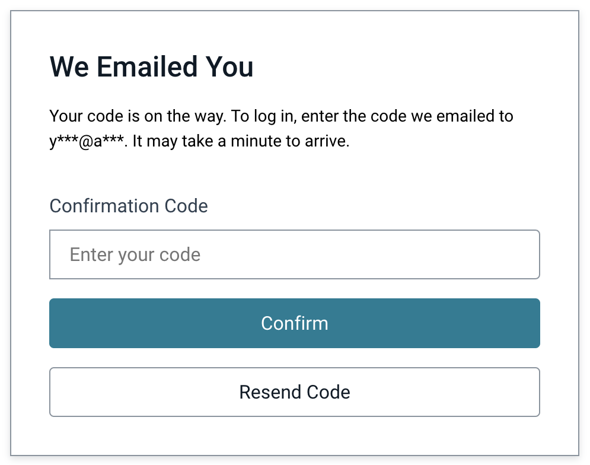

# Amazon Omics Analysis App

## 日本語の解説記事は[こちら](README.ja.md)

This repository contains the following codes.

- Frontend application implemented by Vue.js and Quasar.
  - Run bioinformatics workflows with [Amazon Omics](https://aws.amazon.com/omics/)
  - Run secondary analysis (visualization) through [AWS Step Functions](https://aws.amazon.com/step-functions/).
  - Send notification emails with [Amazon Simple Email Service (SES)](https://aws.amazon.com/ses/) on workflow completion.
  - Browse workflow run outputs.
  - View details of the tasks executed in the workflow run.

- Backend API implemented by [Amazon API Gateway](https://aws.amazon.com/api-gateway/) and [AWS Lambda](https://aws.amazon.com/lambda/) function (Python).
  - User authentication with Amazon Cognito.
  - Provides all functionality required by frontend through REST API.

- [AWS CDK](https://aws.amazon.com/cdk/) stack to deploy frontend and backend.

## Screenshots

<p align="center">
  
  
  
  
  
</p>

## Architecture



## Getting started

### Prerequisites

- [AWS Command Line Interface (AWS CLI)](https://aws.amazon.com/cli/)
- Node.js
- Docker

### Edit cdk.json

Edit [cdk.json](../cdk/cdk.json) as needed.

- `allowdIPv4AddressRanges`: IPv4 address range you want to allow access.
- `allowdIPv6AddressRanges`: IPv6 address range you want to allow access.
- (Removing both items above will deploy without IP address restrictions)

Example
```
"context": {
  "allowdIPv4AddressRanges": ["100.100.100.0/24"],
  "allowdIPv6AddressRanges": ["1000:1000:1000:1000::/64"],
  ...
}
```

### Deployment

Execute the following commands in `/cdk` directory.

```
npm ci
npx cdk bootstrap
npx cdk deploy OmicsBackendStack --require-approval never
npx cdk deploy OmicsFrontendStack --require-approval never
```

### Verify your email address

To receive email of workflow completion notification, your email address must be verified by following [instructions](https://docs.aws.amazon.com/ses/latest/dg/creating-identities.html#verify-email-addresses-procedure) due to Amazon Simple Email Service (SES) security restrictions.

### Sign in

Now you can use this application by accessing the following URL displayed as `OmicsFrontendStackxxxx.FrontendURL`.

```
OmicsFrontendStackxxxx.FrontendURL = https://xxxx.cloudfront.net
```


To create an account, select the 'Create Account' tab, enter your email and password, and click the 'Create Account' button.



When you receive an email with the title 'Verify your new account', enter the 6-digit number written in that email in the 'Verification Code' field and click the 'Confirm' button.



Then, an account will be created and the application will be displayed.

## Documents

- [REST API specification](docs/api.ja.md)
- [Step Functions state machine definition](docs/stepfunctions.md)
